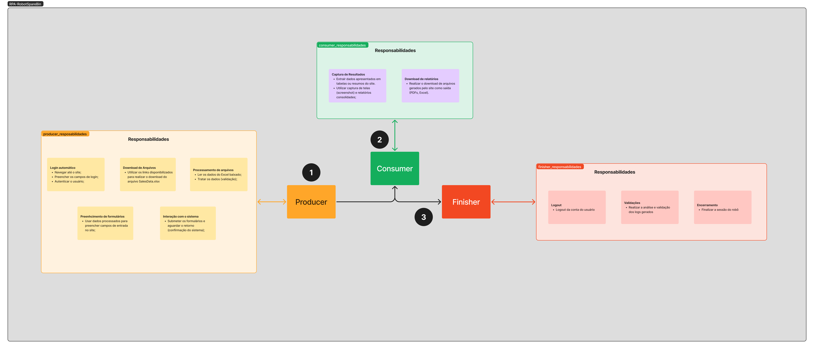

# RPA ROBOTSPAREBIN

- Projeto destinado a implementar uma estrutura funcional para RPAs;
- Será utilizado o ROBOT FRAMEWORK
- Modularização e padronização dos scripts de automação

### Container
Iniciar container com docker-compose
Abrir bash do container para poder rodar os comandos .robot

### Habilitar interface gráfica linux (Obrigatório)
Xvfb :99 -screen 0 1280x1024x24 & 

### Ativar client NVC

x11vnc -display :99 -nopw -forever &

### setar qual display será utilizado
export DISPLAY=:99

### Abrir chrome

google-chrome --no-sandbox --disable-gpu --disable-software-rasterizer --disable-dev-shm-usage --window-size=1920,1080G
---

# Arquitetura / Modularização

